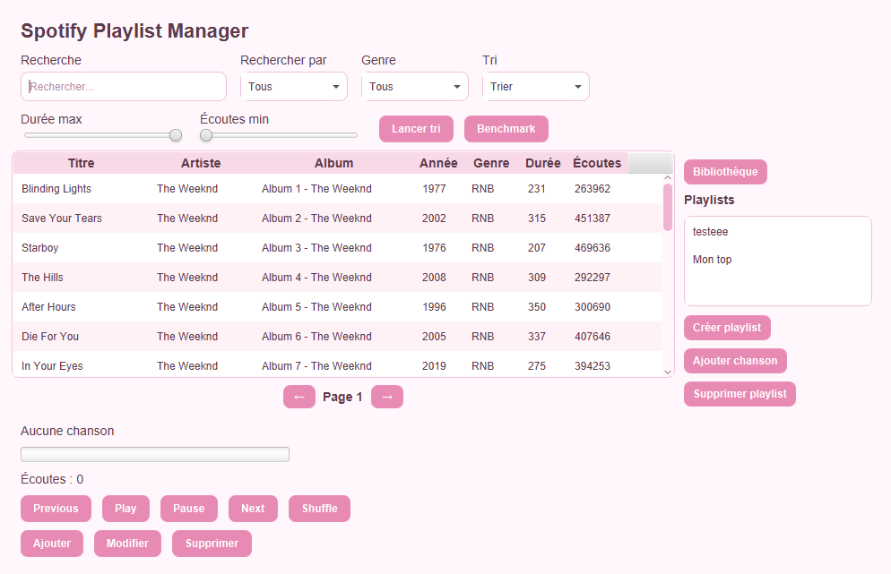
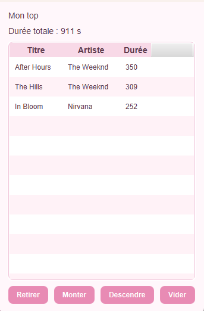
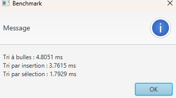

# Spotify Playlist Manager - Lab2

#### **Cours** : 420-930-MA — Algorithmes et modèles de programmation
#### **Session** : Été 2026, groupe 25604
#### **Laboratoire** : 2 (Application JavaFX v1)
#### **Date de remise** : 13 septembre 2026, 23h59

Application JavaFX de gestion de chansons et de playlists, inspirée des applications de streaming musical comme Spotify.
Le projet permet de consulter une bibliothèque de chansons, effectuer des recherches et des filtres, trier les chansons avec plusieurs algorithmes, gérer des playlists et simuler la lecture d'une chanson.
Le projet utilise maintenant PostgreSQL et JDBC pour permettre la sauvegarde des chansons et des playlists dans une base de donnees.
---

## Équipe

| Nom complet | Adresse courriel | Contribution principale                                   |
|-------------|------------------|-----------------------------------------------------------|
| Toleen Msabeh| msabeetl@gmail.com | modèles, services, tri, benchmark, lecture du CSV,  schéma SQL, scripts, connexion, implémentation DAO |
| Unaiza Ali, Bhatti | e2596363@cmaisonneuve.qc.ca | UI FXML, Controller, CSS,  formulaires JavaFX, validation des saisies, gestion des erreurs, README |


---

## Sujet choisi

**Numéro du sujet** : 3
**Nom du sujet** : Spotify Playlist Manager

---

## 🔗 Lien du dépôt GitHub PUBLIC

**URL** : https://github.com/toleen-m/spotify-playlist-manager

---

## Fonctionnalités implémentées

### ✅ Obligatoires (cocher ce qui est fait)

- [✅] Architecture MVC avec packages séparés (model / service / algorithmes / controller / util)
- [✅] Chargement des données depuis fichier CSV (nombre de lignes : 400)
- [✅] Interface JavaFX principale avec liste/tableau
- [✅] Panneau détail affichant l'élément sélectionné
- [✅] Pagination fonctionnelle (taille de page : 25)
- [✅] Filtres multi-critères combinables (nombre implémentés : 4 / 4)
- [✅] Recherche par texte en temps réel
- [✅] Interface Algorithme définie
- [✅] Tri #1 implémenté : Tri à bulles
- [✅] Tri #2 implémenté : Tri par sélection
- [✅] Tri #3 implémenté : Tri par insertion
- [✅] Comparateur/benchmark des tris avec mesure du temps
- [✅] Wishlist / Favoris (ajout, retrait, pas de doublons)
- [✅] CSS appliqué (thème visuel du projet)

### 🎁 Bonus (cocher ce qui est fait)

- [ ] [Bonus 1 : ex. Mode sombre/clair]
- [ ] [Bonus 2 : ex. Statistiques]
- [✅] [Bonus 3 : Bouton Shuffle]

### ❌ Non implémenté (assumer honnêtement)

- Recherche insensible aux accents — manque de temps
- Faire le filtre, le tri et recherche sur la list des chansons dans une playlist

---

## Structure du projet

```

├── screenshots/
│    ├── principal.png
|    ├── playlist.png
|    └── benchmark.png 
|   
├── pom.xml
├── src/ 
  └── main/ 
      ├── java/ 
      │ └── org/ 
      │     └── example/ 
      │         ├── MainFx.java 
      │         │ 
      │         ├── model/ 
      │         │   ├── Chanson.java 
      │         │   ├── Genre.java 
      │         │   ├── Playlist.java 
      │         │   ├── Bibliotheque.java 
      │         │   ├── ResultatTri.java 
      │         │   └── ResultatBenchmark.java 
      │         │ 
      │         ├── service/ 
      │         │   ├── LecteurSimule.java 
      │         │   ├── ServiceTri.java 
      │         │   ├── ServiceBenchmark.java 
      │         │   ├── ServiceFiltre.java 
      │         │   ├── ServiceRecherche.java 
      │         │   ├── ServicePagination.java 
      │         │   └── ServicePlaylist.java 
      │         │ 
      │         ├── algorithmes/ 
      │         │   ├── Algorithme.java 
      │         │   ├── TriBulles.java 
      │         │   ├── TriInsertion.java 
      │         │   └── TriSelection.java 
      │         │ 
      │         ├── controller/ 
      │         │   ├── MainController.java 
      │         │   └── PlaylistController.java 
      │         │ 
      │         └── util/ 
      │             ├── LecteurCSV.java 
      │             └── SourceDonnees.java 
      │ 
      └── resources/ 
          ├── main-view.fxml 
          ├── playlist-view.fxml 
          ├── style.css 
          └── data/ 
              └── chansons.csv

```

---

## Instructions pour lancer le projet

### Prérequis

- JDK 21
- Maven 3.13.0
- (optionnel) IntelliJ IDEA / Eclipse
- JavaFX 17.0.6
- Postegres
- PgAdmin


### Creation de la base de donnees

- Cree dans pgAdmin4 une nouvelle database nommee `spotify_db`

### Installation du projet

```bash
# 1. Cloner le dépôt
git clone https://github.com/toleen-m/spotify-playlist-manager.git
cd spotify-playlist-manager
```

### Connexion au database spotify_db

- Copier ce qui est dans `schema.sql` et coller dans un query tool du databse spotify_bd dans pgAdmin2, puis executer
- Copier ce qui est dans `donnees.sql` et coller dans un autre query tool du meme databse, puis executer
- Cree un fichier nommee `Connexion` dans le dossier dao/ et rempliser avec vos information (reference aux fichier modele ExampleConnexion)

### Lancer l'application dans IntelliJ

1. Ouvrir le projet dans IntelliJ (File > Open > dossier du projet)
2. Attendre que Maven télécharge les dépendances
3. Ouvrir `MainFx.java`
4. Cliquer sur le bouton Run

---

## Choix techniques

### Version Java utilisée
Java 21
JavaFX Controls 17.0.6
JavaFX FXML 17.0.6

### Format des données
CSV
Séparateur: id,titre,artiste,album,annee,genre,duree,nbr_ecoute
Nombre de lignes: 400

### Algorithmes de tri implémentés
- Tri à bulles, Complixite: O(n²)
- Tri par sélection, Complixite: O(n²)
- Tri par insertion, Complixite: O(n²)

### Bibliothèques externes utilisées
- org.openjfx:javafx-controls
- org.openjfx:javafx-fxml

---

## Difficultés rencontrées

Une des difficultés rencontrées a été le lancement de l'application JavaFX directement avec IntelliJ.

L'erreur :
```
JavaFX runtime components are missing
```
pouvait apparaître lors du lancement direct de MainFx.

La solution utilisée a été de lancer le projet avec Maven et le plugin JavaFX :
- .\mvnw.cmd javafx:run
---

## Répartition du travail (auto-évaluation)

| Membre | % contribution estimée | Ce sur quoi j'ai travaillé |
|--------|-----------------------|------------------------------|
| Toleen | 50%                   | modèles, bibliothèque, playlists, lecture simulée, recherche, filtres, pagination, algorithmes de tri, benchmark, lecture du CSV |
| Unaiza | 50%                   | FXML, contrôleurs, TableView, boutons, affichage, ProgressBar, pagination visuelle, fenêtres, CSS |


---

## Notes pour le correcteur

- Pour lancer un tri, il faut choisir un critaire du combopox Tri, puis clicker le bouton `Lancer tri`
- Le benchmark est accessible via le bouton benchmark
- Pour ajouter une chanson dans un playlist: il faut clicker la playlist puis clicker le bouton `Ajouter chanson` apres, double clicler la chanson et reclicker le bouton `Ajouter chanson`
- Pour voir la list des chansons d'une playlist: double clicker le nom du playlist

---

## Captures d'écran (fortement recommandé)


### Écran principal


### Écran de playlist


### Écran de benchmark



---

## Historique Git

**Nombre total de commits** : 54
**Date du premier commit** : Sep 15, 2026
**Date du dernier commit** : Sep 20, 2026

Voir l'onglet **Insights > Contributors** de GitHub pour voir la contribution de chacun.

---

